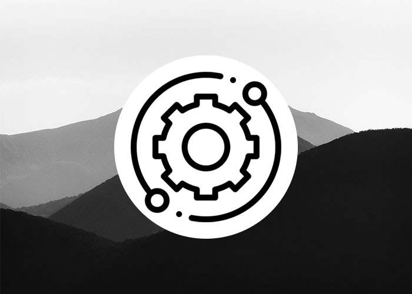
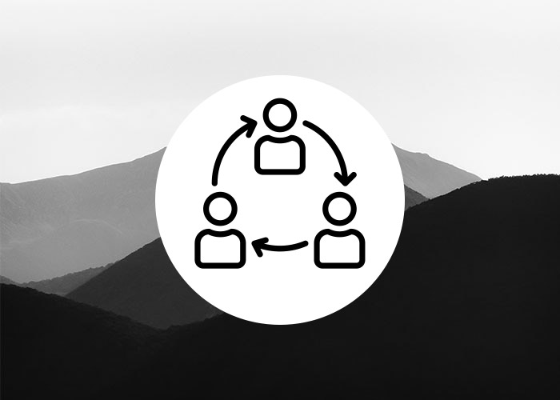

<!-- Header -->
<header class="masthead">

  

    <h1 class="mx-auto my-0 text-uppercase">Make your tech ideas awesome</h1>
    <h2 class="text-white-50 mx-auto mt-2 mb-5">Experts cloud, infra et architecture, nous accompagnons les startups et les entreprises du numérique dans leurs projets tech et télécom 🚀</h2>
    <a href="#services" class="btn btn-primary btn-fix m-2 js-scroll-trigger"><i class="fas fa-code fa-lg"></i> Nos services</a>    
    <a href="#about" class="btn btn-secondary btn-fix m-2 js-scroll-trigger"><i class="fas fa-users fa-lg"></i> Nous connaitre️</a>
  

</header>

<!-- About Section -->
<section id="services" class="about-section">
	

	  

	    

	      	<h2 class="text-white mb-4">Ce que nous pouvons faire pour vous 👨‍💻</h2>
			

			  

			    
			    

			      <h4 class="card-title">Créer votre infrastructure from scratch</h4>
			      

			      
Nous concevons des architectures robustes pour vous permettre de déployer vos applications rapidement et sans coupure.

			    

			    <a class="card-footer btn btn-primary" href="#devops">En savoir plus</a>
			  

			  

			  
			    

			      <h4 class="card-title">Déployer votre application dans le cloud</h4>
			      

			      
On vous accompagne dans la transition cloud de votre infrastructure et de vos applications.

			    

			    <a class="card-footer btn btn-primary" href="#devops">En savoir plus</a>
			  

			  

			  	
			    

			      <h4 class="card-title">Gérer votre infra Ops au quotidien</h4>
			      

			      
Vous concevez l'application, notre équipe d'Ops gère votre infra et sa mise en production.

			    

			    <a class="card-footer btn btn-primary" href="#devops">En savoir plus</a>
			  

			

	    

	  

	 
	

</section>

<!-- Les projets -->
<section id="devops" class="projects-section bg-light">
	

<!-- Devops -->
		

		

		  
		

		

		  

		    

		      

		        <h4 class="text-white">DevOps ⛓️⚙️</h4>
		        

		          Intégration continue, tests automatisés, déploiement continu, brisage des silos Biz / Ops / Dev, évangélisation du mindset agile  
		           
		          Nous sommes persuadés que la collaboration entre les techs, l'automatisation et l’amélioration continue sont essentiels.
		        

		        

		      

		    

		  

		

		

<!-- Cloud -->
	  

	    

	      
	    

	    

	      

	        

	          

	            <h4 class="text-white">Architecture et infrastructure cloud ☁️🎯</h4>
	            

	              Infra As Code, conteneurs, haute-disponibilité, IoT, cloud, 24/7 monitoring et alerting, VOIP. 
	               Créer votre infra , migrer vers le cloud, etc. 
	              Nous concevons des architectures robustes pour vous permettre de déployer vos applications rapidement et sans coupure.
	            

	            

	          

	        

	      

	    

	  

<!-- Ops team -->
	  

	    

	      
	    

	    

	      

	        

	          

	            <h4 class="text-white">Building de votre team Ops 👨‍👩‍👧‍👦🏅</h4>
	            

	              Nous sommes persuadé que l'humain est la clé du succès. 
	               
	              Identifier les rôles clés, recruter et construire son équipe, s'organiser, gérer l'Ops run du quotidien  : pas facile ? On vous accompagne !
	            

	            

	          

	        

	      

	    

	  

</section>

<!-- Contact Section -->
<section id="signup" class="signup-section">
	

	  

	    

	      <h2 class="text-white mb-5">Discutons de vos projets ou obtenez un devis</h2>
	      <a href="/contact" class="btn btn-primary btn-fix m-2 js-scroll-trigger"><i class="far fa-paper-plane fa-lg"></i> Contactez-nous</a>   
	    

	  

	

</section>